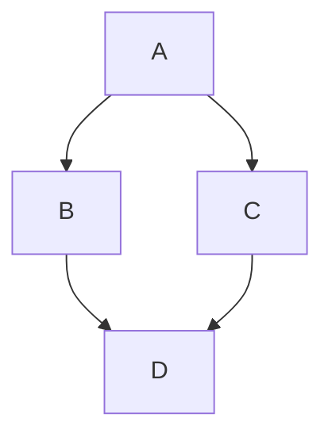

My first post. al-folio is complicated so building blog on my own yay~

My blog can render

Code:
```python
import numpy as np
print('Hello World')
```

Mermaid diagrams:


Plotly plots:
```plotly
{
  "data": [
    {"x": [1, 2, 3, 4], "y": [10, 15, 13, 17], "type": "scatter", "name": "A"},
    {"x": [1, 2, 3, 4], "y": [16, 5, 11, 9], "type": "bar", "name": "B"}
  ],
  "layout": {
    "title": {"text": "Scatter over bars"},
    "margin": {"t": 40, "r": 10, "b": 40, "l": 40}
  }
}
```