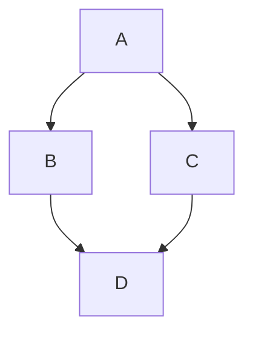

My first post. al-folio is complicated so building blog on my own yay~

My blog can render

Code:
```python
import numpy as np
print('Hello World')
```

Mermaid diagrams:

```mermaid
graph TD;
    A --> B;
    A --> C;
    B --> D;
    C --> D;
```